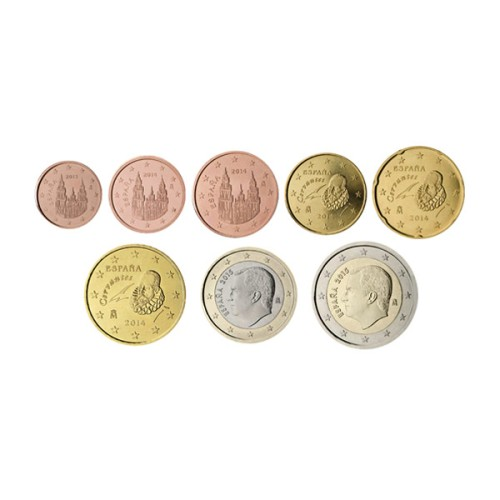

# Coin_detector Image-Based Coin Recognizer

## Overview
This repository contains a Python implementation of an image-based coin recognizer using the OpenCV library. The `CoinDetector` class is designed to identify and analyze coins within a given image, providing information such as the coin's name, area in square millimeters, center coordinates, and radius.

## Features
- **Image Loading:** Load an image from a specified file path.
- **Image Preprocessing:** Apply various image processing techniques, including grayscale conversion, contrast enhancement, Gaussian blurring, and adaptive thresholding.
- **Circle Detection:** Utilize the Hough Circle Transform to identify circular objects within the preprocessed image.
- **Coin Classification:** Classify detected circles as specific coin types based on their areas.
- **Result Visualization:** Display the original image with identified coins, including their names and areas, using contours and text.
- **Resizable Output:** Optionally resize the displayed image for better visualization.

## Usage
1. **Dependencies:**
   - Install the required dependencies:
     ```bash
     pip install opencv-python
     ```

2. **Clone the Repository:**
   - Clone the repository to your local machine:
     ```bash
     git clone https://github.com/your-username/image-coin-recognizer.git
     cd image-coin-recognizer
     ```

3. **Run the Script:**
   - Execute the script:
     ```bash
     python coin_recognizer.py
     ```

4. **View the Output:**
   - The script will load the image, process it, detect coins, and display the result.

## Example
```python
from coin_recognizer import CoinDetector

# Provide the path to the image
image_path = "path/to/your/image.jpg"

# Create a CoinDetector instance
coin_detector = CoinDetector(image_path)

# Process the image and display the result
coin_detector.process_image()
```

## Sample Input

## Sample Output


## Notes
- The coin recognition is based on predefined area ranges for common Euro coins.
- Ensure that the OpenCV library is installed (`pip install opencv-python`) before running the script.
- Feel free to customize the `euro_coin_ranges` dictionary in the `get_coin_name` method for different coin types or regions.

Enjoy identifying and analyzing coins in your images!
